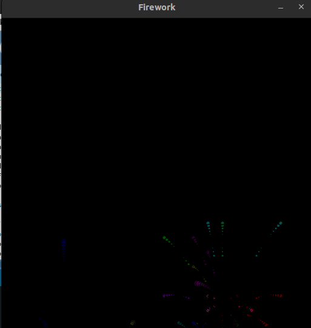
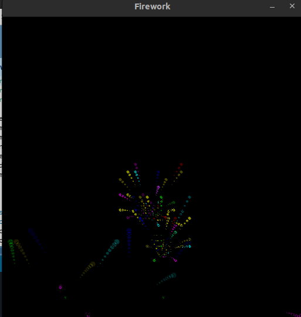
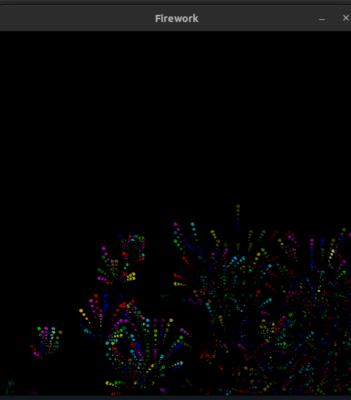
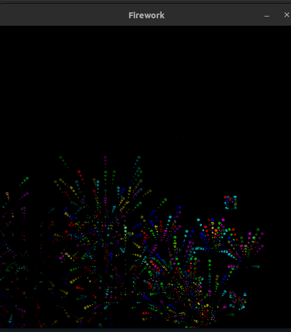

# Fireworks

In this projects, I implement fireworks simulations using processing language
This project contains 2 files:

**[particle.pde](./particle.pde)** : In this file i implement particle class

**[Firework.pde](./Firework.pde)** : In this file i handle fireworks

actions that are implemented:
*   **pressing key `1`** : A random number of 10 to 20 bombs are thrown up and explode.

*   **pressing key `2`** : A random number of 10 to 20 bombs are thrown left from right and explode.

*   **pressing key `3`** : A random number of 10 to 20 bombs are thrown right from left and explode.

*   **clicking mouse** : throw a bomb from where the mouse is clicked, The **longer** the click, the **higher** the bomb goes.

## Results

**without doing any actions(just running)**           | **pressing key `1`**
:-------------------------:|:-------------------------:
 | 

**pressing key `2`**| **pressing key `3`**
:-------------------------:|:-------------------------:
 | 
